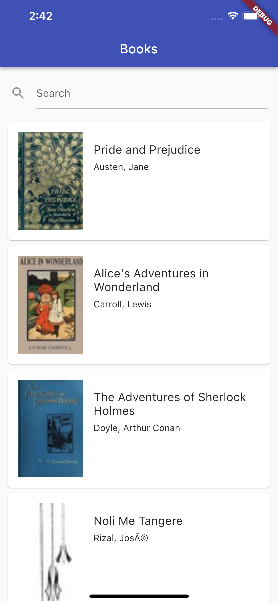
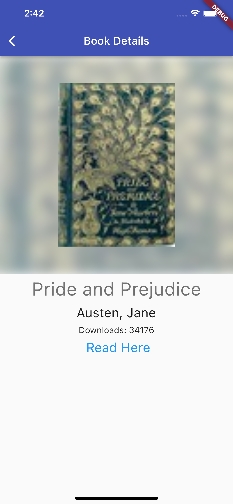

# Flutter Coding Challenge

## Introduction

Create an application that fetches data from the Gutenberg Library API to display books from their library. 

Gutenberg API: http://gutendex.com/

Upload your project to a repository on Github and share it with us.

## Specification

The app should consist of two screens

- An initial screen with a list/grid of books from Gutenberg Library's collection
  This screen should also include a search functionality as well   

- A screen with details of a certain book of the collection.
  This screen is opened when you tap an item in the initial screen. What to display (title, cover, author, etc.) is up to you
  
   
  
  Above are sample views for the app. You can copy the design above or you can create your own.

## Review

We will evaluate your code based on:

1. Functionality (Were you able to finish all required features?)
2. Architectural Decision (Did you adopt any design patterns?)
3. Code quality (Good naming conventions, comments)
4. Testing (Did you create test cases?)
5. Optimizations (refreshing, pagination, etcetc. Optional)
6. Design (Make it pretty. Optional)

